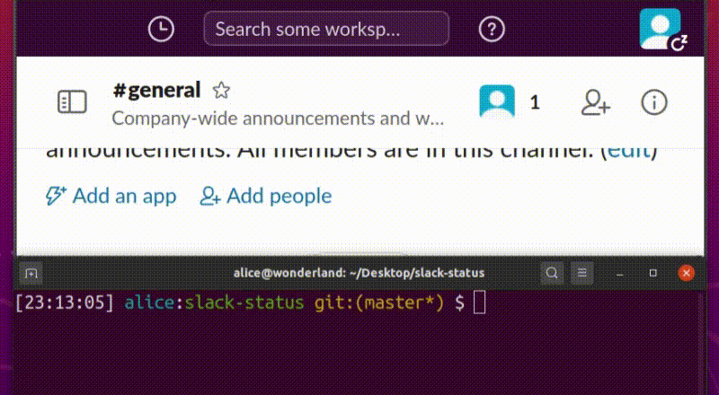

# ⚠️ **Be carefull while using this screen. Test it first on your own workspace**

# Slack Status
A package to change the slack status without API calls.
 
### ⚠️ **It only works for username/password acccounts**

Example:  


## How it works?
It uses a chrome headless browser to login, click & type automatically on the UI in order to change the status of your Slack. 

## Setup
- `npm install -g`. This will install a new command on your terminal called `slack-status`
- Edit the `settings.json` file on this directory with some settings. The file should have this data filled in with your slack workspace URL, account password and email.

```js
{
    "workspace_url": "WORKSPACE_URL",
    "workspace_pwd": "PASSWORD",
    "workspace_email": "EMAIL"
}
```
- Just run `slack-status --status active|away` or `slack-status --toggle`
- You should see your status being toggled on/off


## Stack
- Puppeter to handle all of this
- Node & NPM to make a global command
